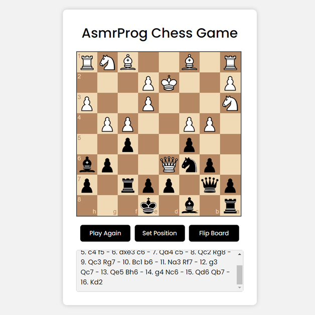
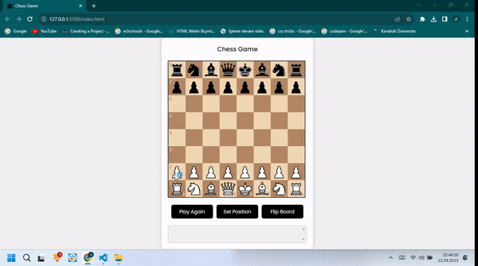

# ChessGame
# Satranç Oyunu

Bu proje, HTML, CSS ve JavaScript kullanılarak oluşturulmuş basit bir satranç oyununu içerir. Bu oyun, iki oyuncu arasında oynanabilir ve temel satranç kurallarını içerir. Aşağıda proje ile ilgili temel bilgilere ve kullanım talimatlarına yer verilmiştir.

## Nasıl Oynanır

1. Proje dosyalarını bilgisayarınıza indirin veya bu repo'yu klonlayın.
2. `index.html` dosyasını bir web tarayıcısında açarak satranç oyununu başlatın.
3. Oyuna başlamadan önce oyun talimatlarını okuyun.

## Oyun Talimatları

- Oyun iki oyuncu arasında sırayla oynanır.
- Her oyuncu 16 taşla başlar: 1 kral, 1 vezir, 2 kale, 2 fil, 2 at ve 8 piyon.
- Sıra sizde olduğunda, taşınızı seçin ve geçerli bir hareket yapın.
- Taşların farklı hareket kuralları vardır. Oyun içinde bu kurallara uymalısınız.
- Hedef, rakip kralını mat etmektir. Mat, rakip kralın hareket edemeyeceği bir konumda olduğunda gerçekleşir.
- Eğer oyunun kuralları ve terimleri hakkında bilgi eksikliğiniz varsa, [Chess.com'un satranç öğrenme kaynaklarına](https://www.chess.com/learn-how-to-play-chess) göz atabilirsiniz.

## Proje Yapısı

Proje dosyaları aşağıdaki gibi düzenlenmiştir:

- `index.html`: Oyunun ana HTML dosyası.
- `styles.css`: Oyunun görünümünü düzenlemek için kullanılan CSS dosyası.
- `chess.js`: Satranç oyununun temel işlevselliğini içeren JavaScript dosyası.

## Katkıda Bulunma

Bu projeye katkıda bulunmak isterseniz, lütfen bir çekme isteği (pull request) gönderin. Katkılarınızı memnuniyetle karşılarız.

## Lisans

Bu proje [MIT Lisansı](LICENSE) altında lisanslanmıştır.

